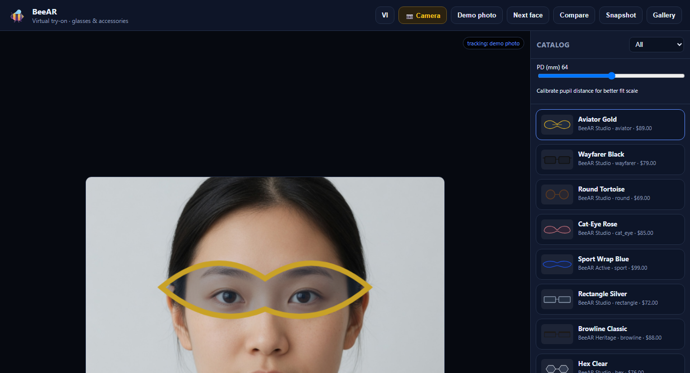
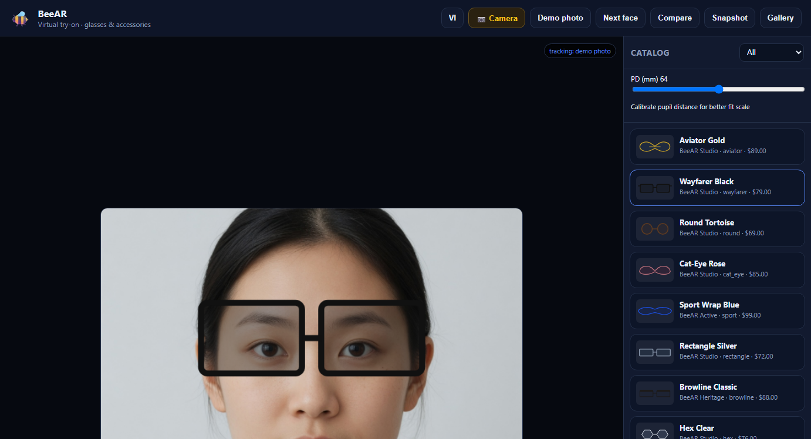
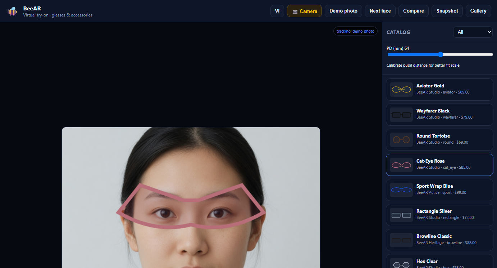
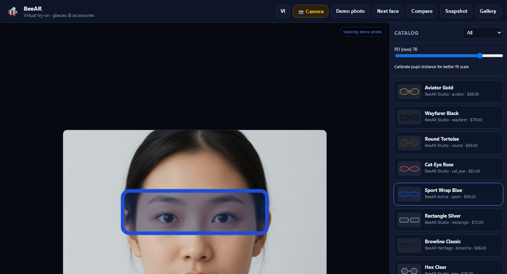
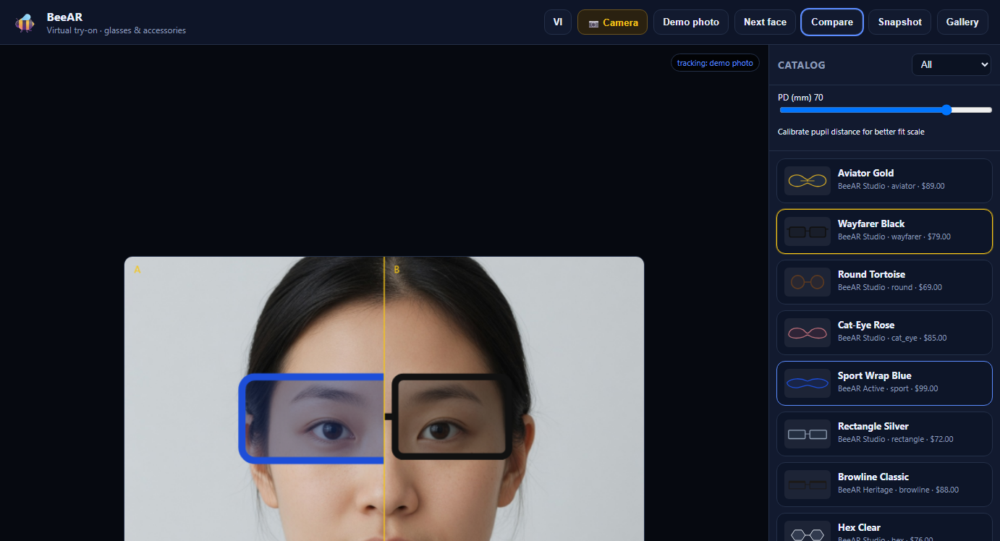
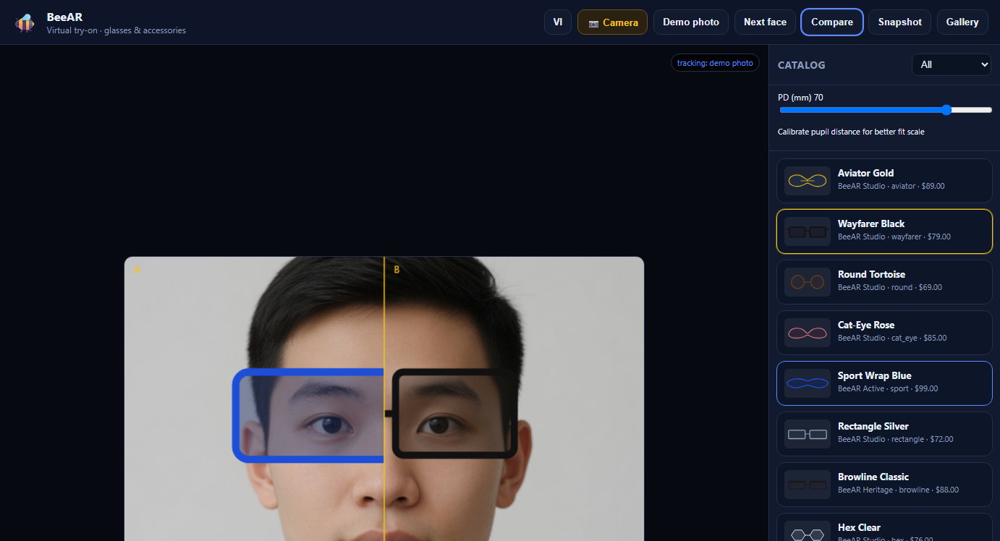
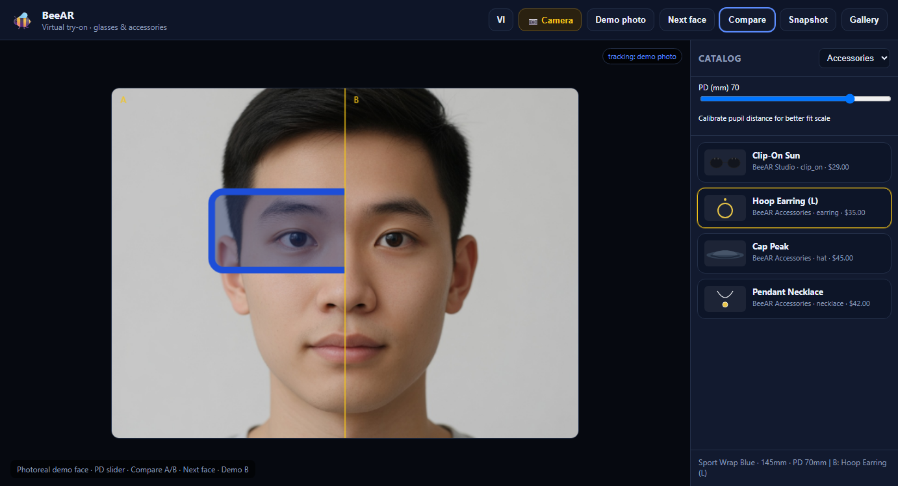
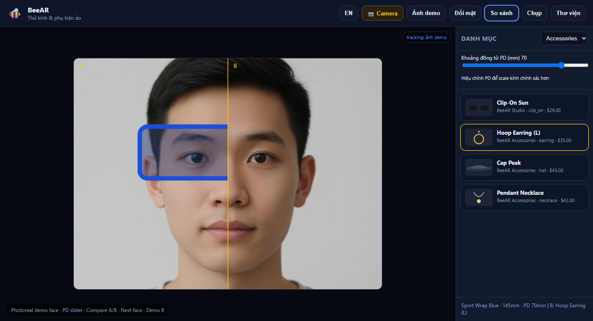

# BeeAR

**BeeAR** is a **virtual try-on** stack for **glasses and accessories** — open the camera (or demo face), pick a frame, and preview fit in real time.

| Package | Role |
| --- | --- |
| **BeeAR Web** | Browser try-on (canvas + face landmarks, MediaPipe optional) |
| **BeeAR Server** | Catalog API, sessions, health (Python FastAPI) |
| **BeeAR Desktop** | Windows shell (Electron) wrapping the web app |
| **BeeAR Android** | Kotlin WebView client for on-device try-on |

Org: [mergeos-bounties](https://github.com/mergeos-bounties) · MergeOS MRG bounties.

## Screenshots (demo face)

Live capture from `beear serve` + **Demo photo** mode (photoreal AI faces, no camera required):

### Aviator Gold (Demo photo A)



### Wayfarer Black



### Cat-Eye Rose



### Sport wrap + PD 70 mm



### Compare A/B



### Demo photo B (Next face)



### Accessories



### Vietnamese UI



Re-capture:

```powershell
# terminal 1
cd packages/server
beear serve --port 8860

# terminal 2
python scripts/capture_screenshots.py
```

## Quick start (offline)

```powershell
cd D:\ThanhTrucSolutions\BeeAR\packages\server
python -m venv .venv
.\.venv\Scripts\activate
pip install -e ".[dev]"

beear demo
beear serve --port 8860
```

Open **http://127.0.0.1:8860** — web try-on UI.

### CLI

```powershell
beear catalog list
beear catalog show aviator_gold
beear version
```

## Desktop (Windows)

```powershell
cd packages\desktop
npm install
npm start
# builds against local server at 8860 (start server first)
```

## Android

See [packages/android/README.md](packages/android/README.md) — WebView loads `http://10.0.2.2:8860` (emulator) or your LAN IP.

## How try-on works

1. Camera stream (or **Demo photo** — photoreal AI-generated faces offline) — consent banner first
2. Demo mode uses `packages/web/assets/demo-faces/*.jpg` with calibrated eye landmarks (**Next face** switches models)
3. Live camera: **MediaPipe Face Mesh** when CDN loads; geometric fallback otherwise
4. **PD (mm)** slider calibrates scale; **Compare** mode splits A/B frames
5. Snapshot → download + local gallery; optional wishlist session API

```powershell
beear tryon fit aviator_gold --pd 66
beear tryon compare aviator_gold wayfarer_black --pd 64
```

## Layout

```
packages/
  server/     # Python CLI + API + static web mount
  web/        # Try-on UI (also served by server)
  desktop/    # Electron Windows shell
  android/    # Kotlin WebView
  catalog/    # Frame SKUs (JSON + SVG assets)
docs/screenshots/
docs/BOUNTY.md
docs/PRIVACY.md
scripts/capture_screenshots.py
```

## MergeOS bounties

1. Star this repo + [mergeos](https://github.com/mergeos-bounties/mergeos)
2. Claim a `bounty` issue
3. Claim on MergeOS [issue #1](https://github.com/mergeos-bounties/mergeos/issues/1)
4. PR to **BeeAR** with tests / screenshots
5. Credit MRG 25 / 50 / 100 / 200

See [docs/BOUNTY.md](docs/BOUNTY.md).

## License

MIT
